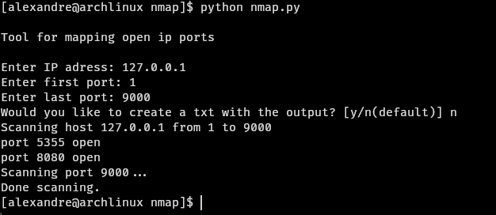

# cybersecurity-with-python
## Repository for security projects in python

### 1 - NMAP for scanning ports in a specified IP adress (using socket)
Scan a range of ports in an IP, create (or not) a file .txt with the open, closed and filtered ports. Change IWANTALLPORTS or ASKTXT values for personal use if you want to. Example of use:

